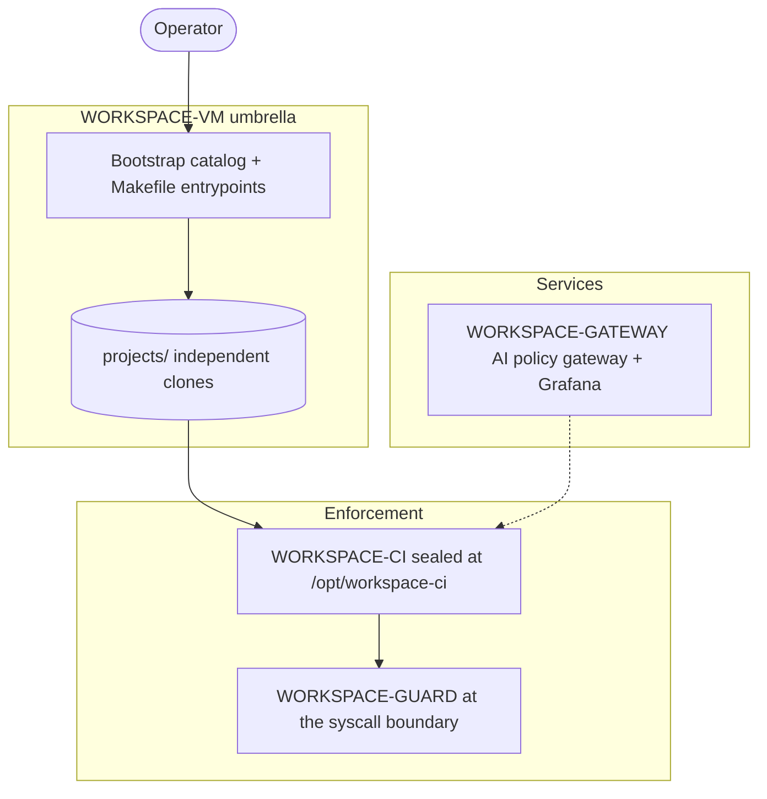

The **Workspace Guardrails** project provides user-owned infrastructure for building and governing digital workspace environments.

A digital workspace is a sandboxed environment where automation, AI models and hosted
services run under policy. It is deployed on hardware you control and uses
established open-source software.

Teams choose it when code, AI traffic, and service data must stay under their own
control.

<!-- workspace-capabilities -->

---

## Glossary

- **Digital workspace.** A sandboxed environment where coding agents and hosted services run under policy.
- **Virtual machine.** The sandbox an agent or service runs in: network off by default, read-only root filesystem, dropped capabilities, resource limits, and a kill switch.
- **Safety and quality gates.** The CI checks that run on commits and pushes: lint, tests, secrets, banned patterns, dependencies, and size.
- **AI policy gateway.** The component that authenticates callers, limits rate and spend, redacts data, and records AI usage.
- **Guard.** The compiled programs that mediate git, shell, binaries, and identity files at the syscall boundary.
- **Sealed artifact.** The verified, read-only copy of the CI engine published below `/opt`.
- **Consumer repository.** A project enrolled to use the workspace gates.
- **Policy as code.** Rules and exemptions stored in configuration files instead of program code.

## Contents

- [Glossary](#glossary)
- [Federation map](#federation-map)
- [Trust domains and edit boundaries](#trust-domains-and-edit-boundaries)
- [Host bring up](#host-bring-up)
- [Deploying the CI engine](#deploying-the-ci-engine)
- [Installing the guard](#installing-the-guard)
- [Integrating a consumer repository](#integrating-a-consumer-repository)
- [Quality gates and the commit flow](#quality-gates-and-the-commit-flow)
- [Policy as code](#policy-as-code)
- [AI traffic governance](#ai-traffic-governance)
- [Agent isolation](#agent-isolation)
- [Identity and secret boundary](#identity-and-secret-boundary)
- [Audit, evidence, and drift](#audit-evidence-and-drift)
- [Where to next](#where-to-next)


## Federation map

| Repository | Role |
| --- | --- |
| `WORKSPACE-VM` | Umbrella: bootstrap catalog, clone manifest, auditable sandboxed environments for agents, host VPN, local inference, benchmarks |
| `WORKSPACE-CI` | Sealed enforcement engine at `/opt/workspace-ci`: native git hooks, quality gates, policy engine, `scaffold-ci`, documentation wiki |
| `WORKSPACE-GUARD` | Compiled guards: git, shell, binary lock, home lock, audit and inventory |
| `WORKSPACE-GATEWAY` | AI policy gateway: per-tenant virtual keys, rate and spend limits, PII redaction, usage and cost in ClickHouse, Grafana dashboards |

Read the umbrella overview at
[`WORKSPACE-VM/README.md`](https://github.com/Independent-AI-Labs/WORKSPACE-VM/blob/main/README.md).



## Trust domains and edit boundaries

Each path belongs to a trust domain. The control column names who may write
there.

| Path | Role | Control |
| --- | --- | --- |
| `projects/WORKSPACE-CI` | CI source tree | Agent |
| `origin/main` | Source authority | Upstream |
| `/opt/workspace-ci` | Sealed artifact | Root |
| `/opt/.workspace-ci.candidate` | Deployment candidate | Root |
| `config/` policy files | Root-owned policy data | Root, via the yaml editor |

- **Below `/opt` is forbidden territory.** All mutations there are prohibited,
  and generated runtime paths are left as published. A failed or absent install
  is remedied by rerunning `make deploy-ci` from reviewed source.
- **Root-owned policy is edited through the secure interface.** Use the
  guard's `yaml-set`, `yaml-add`, `yaml-remove`, `yaml-unset`,
  `yaml-remove-comment`, and `yaml-delete` verbs for policy edits. Root
  ownership of `.git/` metadata and `config/` is the normal state of the
  workspace.

## Host bring up

```bash
make ensure-repos     # clone every repository in the manifest (non-root)
make install          # interactive bootstrap TUI, or:
make install-ci       # unattended bootstrap with fixed defaults
sudo make init        # privileged bootstrap: packages, deploy-ci, guard, hooks, log limits
```

`make init` does several things: it installs system packages
from the catalog, publishes the sealed CI artifact with `deploy-ci`, installs the
git guard, root-owns hooks and exemption files in every consumer repository, and
enforces syslog ceilings. It fails loudly if the CI checkout is missing, so run
`make ensure-repos` first.

Optional operator maintenance:

```bash
sudo make guard-up        # idempotent fleet bring-up (provision + guard install)
sudo make guard-refresh   # refresh guard code after a pull
make guard-check          # read-only health check
```

Component selection lives in
[`workspace/config/bootstrap-components.yaml`](https://github.com/Independent-AI-Labs/WORKSPACE-VM/blob/main/workspace/config/bootstrap-components.yaml).
Bootstrap binaries install into a platform-aware boot directory (`.boot-linux/`
or `.boot-macos/`) that the hooks and CLI extensions resolve by absolute path.

## Deploying the CI engine

`make deploy-ci` is the deployment contract. Run as root, it:

1. clones `origin/main` into `/opt/.workspace-ci.candidate`;
2. builds and verifies the candidate with local boot tools inside a private
   mount namespace, where the candidate is visible at its final logical path;
3. atomically publishes the candidate at `/opt/workspace-ci` on the same
   filesystem and seals it;
4. installs protected hooks as a separate operation.

The current artifact is not used to construct the candidate, and
candidate-path metadata marks the deployment as failed; the fix is a corrected
redeploy. A hook-installation failure leaves the artifact untouched; correct the
failure and rerun the same flow.

When the deployed artifact gates every commit, recover by deploying a
prior sanctioned generation, then land the fix through the restored gates and
redeploy the tip:

```bash
sudo make deploy-ci REV=<commit>   # a committed ancestor of origin/main
```

The working checkout is left in place, and revisions that do not resolve to an
ancestor are refused. The full procedure and rollback decision record are in
[`RUNBOOK-HOOKS.md`](https://github.com/Independent-AI-Labs/WORKSPACE-CI/blob/main/docs/runbooks/RUNBOOK-HOOKS.md).

## Installing the guard

`WORKSPACE-GUARD` wraps the parts of an agent machine that an agent could turn
against the workspace. It is organized into five deployed programs:

| Program | Surface | Install target |
| --- | --- | --- |
| I - Git Guard | Replaces `/usr/bin/git`, enforces forward-only history, delegates quality checks to the CI hooks | `sudo make reconcile-guard-host-exec` |
| II-A - Binary lock | Contains SUID and file-capability binaries behind policy wrappers | `make install-lock` |
| II-B - Sandbox | Hardened systemd unit template (launcher on the roadmap) | `make install-sandbox` |
| II-C / II-D - Audit and inventory | GTFOBins and konstruktoid baselines, drift checks, auditd and AIDE rules | `make install-auditd`, `make sync-gtfobins` |
| III - Home lock | Root-locks identity files and declared config globs in fleet accounts | `make install-home-lock` |
| Shell guard | Scans every `-c` string and untrusted script body, executes untrusted scripts from a sealed memfd | `sudo make install-shell-guard` |

Build and install the git guard through the CI wrappers:

```bash
sudo make build-guard
sudo make install-guard-host-exec
make check-guard-host-exec        # read-only, runs as the agent
```

The guard's public description and install table are in
[`WORKSPACE-GUARD/README.md`](https://github.com/Independent-AI-Labs/WORKSPACE-GUARD/blob/main/README.md).
Policy YAML under the guard config root is edited with the sudo-gated
`workspace-yaml-edit` binary; block and sanitize reports can be rerouted to a
working-directory audit sink for agent sessions.

## Integrating a consumer repository

`scaffold-ci` is the profile-driven bootstrapper that enrolls a repository:

```bash
make scaffold-ci CONSUMER=<path> ARGS="--force-precommit --yes"
```

It generates the CI integration files, including `.pre-commit-config.yaml`,
which declares hooks, stages, and file gates. The engine reads that file and
generates native `.git/hooks/*` scripts from it; there is no framework runtime
and no remote hook environment to clone. Requirements are in
[`REQ-SCAFFOLD-CI.md`](https://github.com/Independent-AI-Labs/WORKSPACE-CI/blob/main/docs/requirements/REQ-SCAFFOLD-CI.md).

Enforcement is tiered per project, resolved through `project_enforcement.yaml`:

- **`strict`.** Full enforcement; the default for first-party code.
- **`poc`.** Safety subset: secrets, sensitive files, banned words, commit hygiene.
- **`vendored`.** No hooks installed, for frozen or mirrored trees.

Any `config/<stem>.yaml` can be redirected at runtime without copying the
tree. `CI_CONFIG_DIR`, the `CI_CONFIG_OVERRIDES` manifest, and per-file
`CI_CONFIG_PATH_{STEM}` variables resolve the same way across the bash hooks,
the Python checkers, and the wiki.

## Quality gates and the commit flow

The gates run in three stages:

| Stage | What runs | Why it belongs there |
| --- | --- | --- |
| pre-commit | Format, lint, secrets, banned patterns, swallowed-error scan, dependency validation, file and module size, coverage no-devolution | Fast, content-focused gates before a commit is recorded |
| commit-msg | Message format compliance and agent-attribution blocking | Reads the message file |
| pre-push | Full test suite and coverage thresholds, web and JS quality, co-authored history scan, advisory dead-code report | Expensive gates that run when code leaves the machine |

Mirror the push gate locally before pushing:

```bash
make check        # lint + type-check + test
make check-push   # pre-push gate
```

Commit with `git commit` and the message supplied through `-F`. If nothing was
staged, the pre-commit gate stages everything and fails with instructions, and
re-running the same command succeeds. Selective staging, `stash`, `reset`, and
`--amend` are unavailable; history is forward-only and uncommitted changes are
included in the next commit. When a gate fails, fix the source and commit again.

## Policy as code

The gates read their rules from configuration files, so a policy change is a
config change with no code edit:

- **Banned patterns.** Project prohibitions that no linter encodes live in
  `config/banned_words.yaml`, with per-project narrowing in the versioned
  exemption file.
- **Swallowed-error detectors.** Patterns across Python, JavaScript, shell,
  Ansible, and cron.
- **File classifications and per-file exemptions.** An exemption names a rule
  and a path.
- **Coverage floors and module-size limits.** Thresholds that can only rise,
  and structural limits on source files and modules.
- **Effective-exemption receipts.** Generated deterministically and gated for
  drift, the same way lockfiles are.

Any `config/<stem>.yaml` file can be redirected at runtime without copying the
tree. `CI_CONFIG_DIR`, the `CI_CONFIG_OVERRIDES` manifest, and per-file
`CI_CONFIG_PATH_{STEM}` variables resolve the same way across the bash hooks,
the Python checkers, and the wiki. The matching model is specified in
[`REQ-BANNED-PATTERN-MATCHING.md`](https://github.com/Independent-AI-Labs/WORKSPACE-CI/blob/main/docs/requirements/REQ-BANNED-PATTERN-MATCHING.md)
and
[`REQ-DEPENDENCY-VALIDATION.md`](https://github.com/Independent-AI-Labs/WORKSPACE-CI/blob/main/docs/requirements/REQ-DEPENDENCY-VALIDATION.md).

## AI traffic governance

Every model call passes through `WORKSPACE-GATEWAY`, an APISIX relay that
applies policy before a request reaches a provider:

- **Per-tenant virtual keys.** Issued into OpenBao and resolved at request
  time, so a key can be revoked without touching client configuration.
- **Rate and spend limits.** Per-key requests-per-minute caps and token or cost
  budgets.
- **Data handling.** PII is redacted on the way out and re-hydrated on the way
  back.
- **Upstream key rotation.** Named pools select a key and rotate it on quota or
  rate-limit responses.

Usage and cost land in ClickHouse on a billing-grade schema with tiered
retention, and the provisioned Grafana dashboards chart spend, health, and
per-model performance. Overview in
[`WORKSPACE-GATEWAY/README.md`](https://github.com/Independent-AI-Labs/WORKSPACE-GATEWAY/blob/main/README.md).

## Agent isolation

Agents and services run inside sandboxes. `make vm` provisions a runtime from a
YAML settings file, with lifecycle state kept under `.vms/`:

- **Rootless Podman** by default, air-gapped with `network.mode: none` when no
  network mode is supplied.
- **QEMU** when the guest needs its own kernel, so host guardrails cannot be
  bypassed; the authoritative guard end-to-end tests run there.
- **Read-only host access.** The host repository is never mounted writable:
  Podman copies or syncs into a named volume, and QEMU exposes the tree
  read-only over virtio-9p and provisions a writable guest-disk copy.
- **Containment controls.** Read-only root filesystem, dropped Linux
  capabilities, `NoNewPrivileges`, and resource limits.

Architecture and network modes are in
[`SPEC-VM-HYPERVISOR.md`](https://github.com/Independent-AI-Labs/WORKSPACE-VM/blob/main/docs/specifications/SPEC-VM-HYPERVISOR.md).

## Identity and secret boundary

- **Home lock.** Root owns `~/.gitconfig`, `~/.ssh/*`, and declared config
  globs in fleet accounts, so an agent cannot open them for write.
- **SSH key material.** Provisioned keys are kept off agent-readable disk and
  offered through the guard-managed ssh wrapper, scoped by an allowlist.
- **Sensitive files.** Names such as `.env`, `*.pem`, and `credentials.json`
  are blocked from commits.
- **Secret scanning.** gitleaks runs across all non-gitignored files before a
  commit is recorded.
- **Secret stores.** Inline credentials are prohibited; automation reads
  sanctioned secret-store paths.

Policy lives in `config/shared_locked_paths.yaml` and
`config/git_ssh_allowlist.yaml`. Overview in
[`WORKSPACE-GUARD/README.md`](https://github.com/Independent-AI-Labs/WORKSPACE-GUARD/blob/main/README.md).

## Audit, evidence, and drift

- **Block evidence.** Guard blocks are written to root-owned per-UID files under
  `/var/log/workspace-guard/` and reported on `/dev/tty`, with reversibly
  encoded detail.
- **System audit.** auditd and AIDE rules cover the guard surfaces; GTFOBins and
  konstruktoid baselines are refreshed and diffed with `make drift-check`.
- **Deployment integrity.** `ci_integrity` verifies that `/opt/workspace-ci`
  matches its expected content, so an agent-modified deployment is detected
  even when ownership still looks correct.
- **Policy drift.** Effective-exemption receipts and route and config renders
  are gated for drift on every run.
- **History evidence.** History is forward-only, so the commit graph records
  what shipped and when.

Sources:
[`WORKSPACE-GUARD/README.md`](https://github.com/Independent-AI-Labs/WORKSPACE-GUARD/blob/main/README.md),
[`SPEC-AUDIT.md`](https://github.com/Independent-AI-Labs/WORKSPACE-GUARD/blob/main/docs/specifications/SPEC-AUDIT.md),
and `src/ci_integrity.rs`.

## Where to next

- Documentation hub and reading order:
  [`docs/README.md`](https://github.com/Independent-AI-Labs/WORKSPACE-CI/blob/main/docs/README.md)
- CI engine, gates, and tiers:
  [`WORKSPACE-CI/README.md`](https://github.com/Independent-AI-Labs/WORKSPACE-CI/blob/main/README.md)
- Umbrella subsystems:
  [`WORKSPACE-VM/README.md`](https://github.com/Independent-AI-Labs/WORKSPACE-VM/blob/main/README.md)
- Protected hook deployment and rollback:
  [`RUNBOOK-HOOKS.md`](https://github.com/Independent-AI-Labs/WORKSPACE-CI/blob/main/docs/runbooks/RUNBOOK-HOOKS.md)

The wiki catalogues come from these same policy sources: `/git-hooks`,
`/anti-patterns`, `/hook-configs`, `/sandbox-configs`, `/tools-scripts`,
`/static-analysis`, and `/llm-gateway`.
