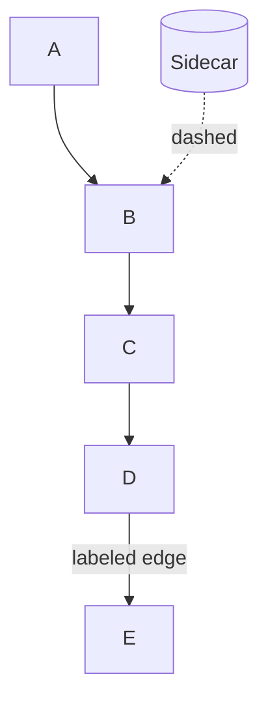
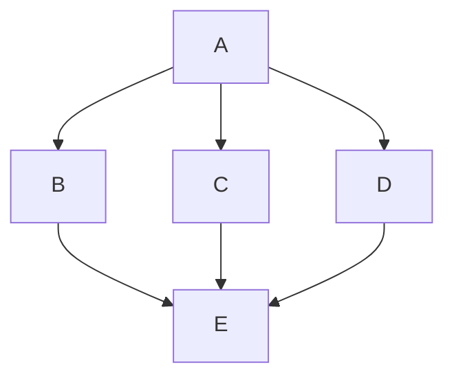

# Workflow: Creating Architecture Diagrams

Team workflow for creating and reviewing Mermaid architecture diagrams in
any repo README or docs. Not a user-facing tutorial: a checklist for
contributors and agents.

Canonical path: `projects/CI/workflows/WORKFLOW-CREATING-DIAGRAMS.md`

## When to diagram

**One diagram = one message.** Stop when a second concern appears:

| Concern | Diagram type | Typical doc section |
|---------|--------------|---------------------|
| Who talks to whom at system scope | System context | Architecture / overview |
| How one unit of work flows through components | Request or processing path | Components, plugins, pipeline |
| Where logs or events land after processing | Telemetry and logging | Persistence, observability |
| Metrics export and dashboard read paths | Metrics and dashboards | Operations, monitoring |
| Config render, seed, and live state | Control plane | Configuration, deployment |
| Auth or policy decision logic | Decision flow | Security, key management |
| Which variants ship in this repo | Sample deployments table | Architecture (table, not diagram) |

If you need two messages, use two diagrams (or diagram + table). Do not merge
context, deployment, data flow, and observability on one canvas.

## Placement: distribute, do not clump

Diagrams belong in the **section that owns the concern**, immediately before or
after the prose/tables they illustrate. Readers should encounter the diagram
while reading about that topic, not in a single "diagram gallery" block.

| Do | Don't |
|----|-------|
| Put the path diagram in the section that owns the pipeline | Stack numbered diagrams 1-5 under Architecture |
| Put the telemetry diagram above the table it explains | Repeat every flow in a single "How it works" essay |
| Put the metrics diagram in the monitoring section | Number diagrams globally across the doc |
| One document-wide legend at the first diagram | Repeat the legend before every diagram |

Cross-link from overview sections with short pointer lists to section anchors,
not a diagram inventory.

## Diagram types

Mapped to [C4](https://c4model.com/) and
[Azure WAF design diagrams](https://learn.microsoft.com/en-us/azure/well-architected/architect-role/design-diagrams).

### System context (C4 level 1)

- **Audience:** anyone opening the repo
- **Nodes:** clients, the documented system, external dependencies
- **Exclude:** internal plugin/module names, control-plane stores, observability sinks
- **Budget:** ≤7 nodes

### Request or processing path

- **Audience:** implementers
- **Message:** single happy-path spine for **one** entry point or route
- **Include:** processing stages only for that path
- **Exclude:** telemetry sinks, metrics stores, config backends unless the diagram is about those
- **Budget:** ≤7 nodes
- **Caption:** note how other entry points differ

### Telemetry and logging

- **Audience:** implementers tracing logs or events
- **Message:** post-processing path to storage (one path per sink)
- **Start from:** upstream response or telemetry component, not the client
- **Budget:** ≤6 nodes
- **Keep separate** from the request-path diagram

### Metrics and dashboards

- **Audience:** operators and dashboard authors
- **Message:** export path and read/query paths
- **Exclude:** request routing and config seeding unless that is the topic
- **Budget:** ≤6 nodes
- **Dashboard to datastore:** dashed, labeled `queries` or `SQL queries`; not a solid write

### Control plane

- **Audience:** deployers and config editors
- **Message:** template or source to seed to live runtime config
- **Include:** admin API as dashed sidecar (not on the request path)
- **Exclude:** business upstreams and telemetry sinks
- **Budget:** ≤7 nodes

### Decision flow

- **Audience:** implementers debugging auth or policy
- **Layout:** top-to-bottom with converging branches (one outcome node)
- **Use edge labels** for variant-specific behavior, not duplicate nodes

### Sample deployments

- **Format:** markdown table, not a diagram
- **Title:** `Sample deployments in this repo` (not "Current deployment")
- **Column:** `Sample upstream` or `Sample target` (not "today" / "production only")
- **Prose:** sample framing (`In this sample, ...`) not exclusivity claims

## Layout rules (Mermaid)

1. Prefer `flowchart TB` with a **single downward spine** (top to bottom reading).
2. **Avoid fan-out:** do not connect one node to 3+ siblings then merge (spider).
3. Group peers with `subgraph` + `direction LR` only at the same tier.
4. **Orphan nodes float**: attach sidecars with dashed edges or put them in a subgraph.
5. Do **not** rely on ELK/tidy-tree `%%{init}%%`; GitHub README renderer may ignore it.
6. Western reading order: declare nodes in the order you want the story told.

### Reliable spine pattern



Not:



## Arrow semantics

| Style | Meaning |
|-------|---------|
| Solid `-->` | Runtime request/response or data **write** path |
| Dashed `-.->` | Config, lookup, control plane, **read-only** queries |

Rules:

- Label non-obvious edges.
- No bidirectional arrows.
- Read/query paths (e.g. dashboard to database): dashed, labeled; not solid writes.
- Prefer two one-way arrows over double-headed lines.

When mixing solid and dashed in one diagram, add a short **legend** once at the
first diagram in the document.

## Mermaid and markdown hygiene

| Issue | Fix |
|-------|-----|
| Empty diagram in preview | Verify opening ` ```mermaid ` and closing ` ``` ` are on **their own lines** with no extra backticks inside the block |
| Nested backticks in assistant/chat citations | Never wrap a mermaid block inside another fenced code block when editing |
| Unicode em-dash (U+2014) or en-dash (U+2013) | CI `check-banned-words` rejects them; use `:`, `,`, or ASCII `-` |
| Request path + telemetry on one canvas | Split: request spine ends at upstream; telemetry starts at upstream response |
| Metrics only in prose | Add a metrics diagram in the monitoring section |
| Control plane only in prose | Add a control-plane diagram in the configuration section |

Validate fence pairing after edits: count ` ```mermaid ` open/close pairs in
the edited file (each block must end with a lone ` ``` ` line on its own).
Preview at [mermaid.live](https://mermaid.live) or GitHub before merge.

## Pre-merge checklist

- [ ] Diagram sits in the section that owns the concern (not clumped in overview)
- [ ] Diagram type matches audience (context vs path vs decision)
- [ ] Single spine; no spider fan-in/out
- [ ] Request path and telemetry are separate diagrams when both exist
- [ ] Arrow direction matches real data flow (writes solid, reads/config dashed)
- [ ] Legend present once if mixing solid and dashed
- [ ] Node count within budget (≤7 context/path/control, ≤6 telemetry/metrics)
- [ ] Rendered at [mermaid.live](https://mermaid.live) or GitHub preview (non-empty)
- [ ] Prose cross-links sections; no global "Diagram 1 = ... Diagram 5 = ..." laundry list
- [ ] No Unicode em-dash or en-dash in edited markdown
- [ ] `make check` / markdown link checks pass

## AI / agent instructions

When asked to create or edit architecture diagrams:

1. Load this file first.
2. Read the **target repo** (README, architecture docs, config) before drawing.
3. Pick diagram type from the concern table; do not merge concerns on one canvas.
4. Place each diagram in the owning section; use worked examples below only as
   reference for how one repo applied these rules.
5. Do not commit or push unless the user explicitly asks.

## References

- [Azure WAF: Design diagrams](https://learn.microsoft.com/en-us/azure/well-architected/architect-role/design-diagrams)
- [C4 model](https://c4model.com/)
- [Mermaid flowchart syntax](https://mermaid.js.org/syntax/flowchart.html)

## Worked example: WORKSPACE-GATEWAY

*Illustrates the rules above. Do not treat Gateway section names or components
as requirements for other repos.*

### How that repo mapped concerns to sections

| Concern | Section in WORKSPACE-GATEWAY README |
|---------|-------------------------------------|
| System context | Architecture |
| Request path (one federated route) | Plugins |
| Telemetry (ClickHouse ingest) | Configuration / ClickHouse Tables |
| Metrics (Prometheus, Grafana queries) | Configuration / Grafana Dashboards |
| Control plane (etcd, Admin API) | Configuration / Routes and config |
| Key resolution | Key Management |
| Sample routes | Architecture table |

### Product-specific diagram habits (Gateway only)

- Context diagram is **provider-agnostic**: sample vendors belong in deployment
  tables, not as the only upstream node.
- Plugin names belong in request-path diagrams or prose, not the context diagram.
- Routes like `/opencode*` and `/llamafile/*` are **samples in this repo**, not
  the product definition.

Further reading in that repo:
[`docs/architecture/README.md`](../../WORKSPACE-GATEWAY/docs/architecture/README.md),
[`docs/requirements/REQ-DASHBOARD.md`](../../WORKSPACE-GATEWAY/docs/requirements/REQ-DASHBOARD.md).

### Anti-patterns from past Gateway README edits

| Anti-pattern | Fix |
|--------------|-----|
| All flow diagrams under Architecture | Distribute to Plugins, Configuration, Key Management |
| Numbered diagram gallery (Diagram 1-5) | Descriptive headings in owning sections |
| One canvas with routes + plugins + etcd + Vector + Grafana | Split into context + request + telemetry + metrics + control plane |
| Request path diagram includes ClickHouse/Vector branches | Request path in Plugins; telemetry in Configuration |
| Naming one vendor as headline upstream in a multi-provider doc | Generic "Cloud LLM APIs" node; vendor in sample table |
| `### Current deployment (this repo)` | `### Sample deployments in this repo` |
| `Upstream today` column | `Sample upstream` |
| `Grafana --> ClickHouse` solid arrow | Dashed `-.->|SQL queries|` |
| Three route nodes fanning from Clients | One route in request-path diagram; others in table |