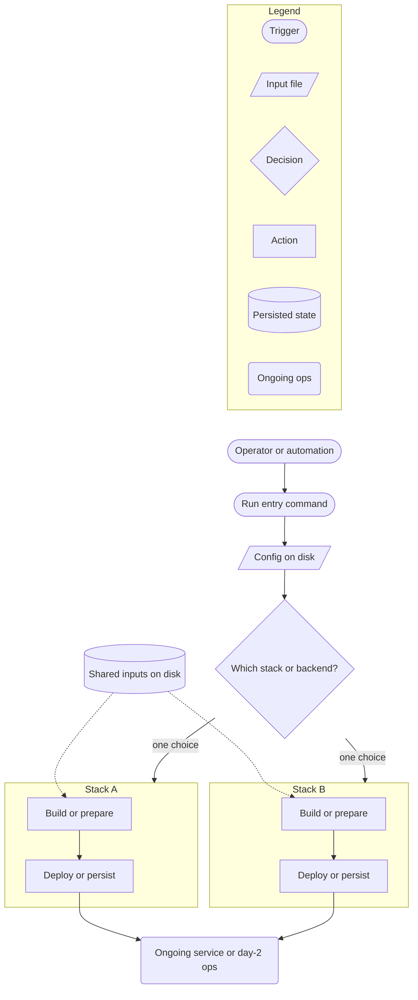

# Workflow: Writing READMEs

Team workflow for technical README bodies in workspace repos: structure,
subsystem sections, installation catalogs, contribution contracts, and how
diagrams and tables fit together. Not marketing copy (see
[WORKFLOW-WRITING-WEBSITE-COPY.md](WORKFLOW-WRITING-WEBSITE-COPY.md)) and not
diagram syntax alone (see
[WORKFLOW-CREATING-DIAGRAMS.md](WORKFLOW-CREATING-DIAGRAMS.md)).

Canonical path: `projects/CI/workflows/WORKFLOW-WRITING-README.md`

## When this workflow applies

| Content | Where | This workflow |
|---------|-------|---------------|
| README body (sections 2+) | Any repo `README.md` | Yes |
| Overview / intro (under `#` title) | `README.md` opening prose | Yes (this file); catalogue **card** polish in [WORKFLOW-WRITING-WEBSITE-COPY.md](WORKFLOW-WRITING-WEBSITE-COPY.md) |
| Architecture Mermaid in README | Owning subsystem section | Yes + [WORKFLOW-CREATING-DIAGRAMS.md](WORKFLOW-CREATING-DIAGRAMS.md) |
| REQ/SPEC/TRACK deep docs | `docs/`, `projects/*/docs/` | Cross-link from README; do not paste specs into README |
| Runbooks, incident postmortems | `docs/`, wiki, issue tracker | No (link out; do not dump into README) |
| Commit messages, hook output | hooks, Makefiles | No |

## What a README is for

A README is the **on-ramp**, not the manual. A first-time reader should leave
knowing:

1. **What this repo is** (overview under the title: what + why, not architecture).
2. **How to get something working** (install / host setup: one default path +
   where other paths live).
3. **How major subsystems relate** (short prose, one diagram per concern, tables
   for enumerations).
4. **Where deeper truth lives** (specs, nested READMEs, config YAML).
5. **How to contribute** (commands that mirror CI, not philosophy essays).

If a section needs more than a screen of prose to be honest, **move detail to a
spec** and leave a pointer in README.

## Recommended structure

Order sections by reader journey, not by repo directory tree.

| Section | Purpose | Typical contents |
|---------|---------|------------------|
| Title + overview | Blink test + scope | What + why (+ optional where-with-link); see **Overview** below |
| Host install / Getting Started | Prereqs + install catalog | OS, sudo, boot dirs; **one** mention per setup command |
| Subsystems | How each major feature works | Prose + diagram + table + spec links per subsystem |
| Philosophy / design principles | Why constraints exist | Bullets, not diagrams; link to CI/guard docs |
| Navigation map | Where code and docs live | Markdown table of paths |
| Contribution contract | PR gates | `make check`, hooks, commit format; link to `projects/CI/` |

Rules:

- **Number sections** only when the doc is long and cross-referenced (`Section 2
  covers subsystems`). Do not number every subsection.
- **One default quick start.** Optional paths live in an installation catalog,
  not competing quick-start essays.
- **Subsystem sections are peers.** Do not bury QEMU under Podman in a single
  "Infrastructure" essay unless they share one entry point.

## Overview (intro under title)

The first prose block under `# Title` is the **Overview**. It is also pulled
into federated catalogues (see
[WORKFLOW-WRITING-WEBSITE-COPY.md](WORKFLOW-WRITING-WEBSITE-COPY.md)); prefer
**two sentences** when the wiki card must not truncate, but technical accuracy
beats brevity when the product cannot be honest in two lines.

### Job of the overview

Answer in order (inverted pyramid: most important first):

| Order | Question | Belongs in overview |
|-------|----------|---------------------|
| 1 | **What** is this? | One sentence: noun + what it does for the reader |
| 2 | **Why** does it exist? | One sentence: problem solved, outcome, constraint enforced |
| 3 | **Where** does it live? | Optional one clause + link (parent repo, federated workspace) |
| 4 | **What next?** | Optional forward link (`See Host install`, `Getting Started`) |

Install commands, deployment-class tables, program inventories, Mermaid, and
hook lists belong in **later sections**, not the overview.

External references (GitHub, makeareadme.com, technical-writing guides) agree:
the README opening states **what the project does** and **why it is useful**;
**how to get started** is the next section, not sentence four of the overview.

### Length and shape

- **Default:** 2 short paragraphs (3-5 lines each), one idea per paragraph.
- **Catalogue-facing repos:** aim for **two sentences** total when possible
  (full blink-test rules in WORKFLOW-WRITING-WEBSITE-COPY).
- **Federated sub-projects** (guard, gateway, portal): three sentences or two
  short paragraphs are fine if sentence 1 is still **what**, not org chart.
- **Do not** pack architecture, implementation stack, and enumeration into one
  paragraph.

### Approved opening pattern

```markdown
# <Descriptive category title, not repo name alone>

**PROJECT-NAME** <sentence 1: category + mechanism + concrete UVP>.

<sentence 2: named programs, surfaces, or backends; catalogue blurb ends here
for wiki cards.>

<Paragraph 2: default install commands + pointer to sections below + spec path.
Match [WORKSPACE-VM](../../WORKSPACE-VM/README.md) second-paragraph shape.>
```

Federated sub-projects (GUARD, GATEWAY): intro names **this repo only**. Parent
and sibling repos mention GUARD/CI in *their* intros; do not reciprocate in
the sub-project catalogue blurb.

### Forbidden in the overview

| Do not open with | Why |
|------------------|-----|
| Repo topology (`Federated sub-project of...`) | Reader does not know what the tool **does** yet |
| Implementation (`Compiled in Rust`, `SUID`, `setcap`) | How, not why; belongs in specs or subsystem prose |
| Program or module inventory (`Four programs cover...`) | Use Architecture section + table below |
| Deployment mechanics (host-exec, PAM, class tables) | Use Host install / Role in framework section |
| Apology or incident narrative (`we fixed`, `regression`, `our mistake`) | README is current truth, not postmortem |
| `production deployment` for WORKSPACE-VM framework components | Framework dev hosts are the primary surface; secured VMs are a tier, not the README hook |
| Internal hostnames in public README prose | Use role names (`agent dev host`) in docs; bind hostnames only in config YAML |
| Repeated install commands | Document each `make` target once under Getting Started / Host install |

### Overview vs catalogue blurb

| Concern | Owner workflow |
|---------|----------------|
| What/why/where structure, no architecture dump | This file |
| Wiki card length, blink test, marketing tone for sentence 1 | WORKFLOW-WRITING-WEBSITE-COPY |
| Architecture, install, diagrams | This file (sections after overview) |

When both apply, draft the overview with **this file**, then trim or sharpen
sentence 1-2 for the catalogue per WEBSITE-COPY without moving install or
topology into the opening.

### Common overview mistakes (any repo)

- **Wall of clauses:** framework + CI + language + caps + four surfaces in one
  breath. Split: overview = what + why; Architecture = inventory.
- **Section name collision:** a heading `## Development` that means "build the
  crate" while the repo is a development **framework** component. Prefer
  `## Building and testing` for harness/docs contributor paths.
- **Burying install:** host install is the main action for guard-like repos;
  put **Host install** or **Getting Started** immediately after overview (or
  Role in framework), not after every subsystem.
- **Repeating setup commands** in overview, Prerequisites, and every installer
  bullet (`make init-check`, `sudo make init`).

## Getting Started

### Prerequisites

List **host facts** the reader must verify once: OS, architecture, sudo needs,
disk paths, external services. Link to a spec for layout detail (e.g. boot
directory spec), do not duplicate the spec body.

### Installation catalog

Use a **bullet list of parallel paths**, each with:

- Human label (what you are setting up).
- Primary command (`make install`, `make llama-setup`, ...).
- Link to spec or config YAML.
- One line on what is **excluded** from other paths (e.g. GPU stack not in
  general bootstrap).

| Do | Don't |
|----|-------|
| State once that installers auto-run shared prereq checks | Repeat `init-check` / `sudo make init` under every bullet |
| Link config YAML for component lists | Paste YAML into README |
| Separate interactive vs CI non-interactive variants | Hide CI entry points |
| Note sudo-only steps in a dedicated Post-install subsection | Scatter sudo commands without context |

### Quick start

One copy-paste block for the **default** path only. Other paths point to the
catalog.

### Post-install

Group **optional or sudo** host tweaks here (`logrotate`, `git-guard`, ...).
Explain **what problem** each step solves in plain language. Do not cite
incident tickets or internal war stories.

## Subsystem sections

Each major feature gets its own `###` heading under a `## Subsystems` (or
equivalent) section.

### Per-subsystem template

1. **One-line thesis** (what choice the operator makes).
2. **Recommended entrypoint** (bash block with one command).
3. **Short prose** (3-5 sentences): config file, mutual exclusion, persisted
   state, exceptions.
4. **One diagram** if the subsystem has a processing path or decision (see
   diagrams below).
5. **Reference table** for profiles, ports, modes, provision levels, etc.
6. **Escape hatches** as bash blocks (`make -f Makefile.foo help`), not diagram
   nodes.
7. **Spec links** as the last line.

### What belongs in README vs specs

| Keep in README | Move to spec / nested README |
|----------------|------------------------------|
| Default command and config path | Module maps, every env var |
| Profile ID + deploy unit + port table | Full wizard phase tables |
| One architecture diagram per concern | VPN packet diagrams, full hook lists |
| Benchmark one-liner + link to `benchmarks/.../README.md` | Benchmark methodology, datasets |
| Contribution commands | Every pre-commit hook name |

### Multi-path subsystems (Podman vs QEMU, llamafile vs llama.cpp)

When the product picks **one of several stacks**:

**Prose:** State upfront that **one profile/path runs per invocation**; name
the config file; call out exceptions (e.g. local binary, no systemd).

**Diagram:** Use the **decision spine** (below), not two unrelated linear
chains. Mutually exclusive branches must **converge on one outcome node**
(e.g. single HTTP server, single `.vms` folder) so readers do not think both
paths deploy at once.

**Tables:** Hold enumerations (all profile IDs, ports, provision modes). The
diagram shows **structure**; the table holds **inventory**.

### Features without architecture diagrams

Some subsystems are **operator commands + spec link** only (host VPN install,
one-off benchmarks). That is fine. Do not draw a diagram just to fill space.

### Benchmarks

Treat benchmarks as **pointers**, not subsystems:

- One sentence: what it measures and what must already be running.
- Command block.
- Link to `benchmarks/<name>/README.md`.

Do not add README architecture diagrams for benchmarks unless the benchmark
**is** the product. Undocumented or experimental benchmarks stay out of
diagrams entirely.

## Diagrams in READMEs

Load [WORKFLOW-CREATING-DIAGRAMS.md](WORKFLOW-CREATING-DIAGRAMS.md) before
editing Mermaid. README-specific rules:

### One diagram = one message

Do not merge install flow, request path, telemetry, and hook pipeline on one
canvas. If Getting Started is catalog prose, **do not** draw `make install ->
make init -> make foo` chains as "architecture"; that is a runbook, not
structure.

### Placement

Put each diagram in the **subsystem section it explains**, immediately after the
prose it supports. No numbered "Diagram 1-5" gallery at the top.

### Decision spine (multi-path products)

Reusable pattern for wizards, hypervisors, and stack pickers:



Adapt labels to the product; **keep the logic**:

| Element | Role |
|---------|------|
| Trigger (stadium) | Human or CI starts the flow |
| Input (parallelogram) | YAML, settings file, profile registry |
| Decision (diamond) | Picks one mutually exclusive path |
| Action (rectangle) | Build, deploy, boot steps inside subgraphs |
| Persisted (cylinder) | Disk state both paths write (or shared weights) |
| Ongoing (rounded) | Running server, day-2 commands, clients |
| Dashed edge | Shared read-only inputs **into build steps**, not into the diamond |

Edge labels on branches: `one profile`, `Podman default`, `QEMU`, not vendor
jargon alone.

### Legend

Use an in-diagram Mermaid `subgraph legend [Legend]` row of **sample shapes**,
not a markdown table legend below the figure. Pin the legend above the main
story with an invisible link (`legOngoing ~~~ operator`) so layout stays stable.

Repeat the **same shape vocabulary** across diagrams in one README when they
share the decision-spine pattern.

### Node labels

| Do | Don't |
|----|-------|
| "Build portable .llamafile from models/" | `Makefile.llamafile`, `llama_setup_install.py` |
| "Stack profiles in llama-setup.yaml" | Bare filename as the only label |
| "Per-VM folder under .vms on host" | `vm_manager`, `persisted_state` |

File paths are OK **inside** a label when they are the actual operator surface
(e.g. `models/`), but pair them with a verb phrase.

### Editing discipline

| Situation | Rule |
|-----------|------|
| User asks to fix only the legend | Touch the `subgraph legend` block only; do not shorten main diagram labels |
| Diagram is wrong | Fix logic first; do not delete **all** diagrams because one is bad |
| Copying a diagram from another subsystem | Rebuild the fork and convergence for **that** product's logic; templates are not copy-paste |
| Two parallel serve nodes to clients | Merge to **one** outcome node when only one runs |

## Prose style (technical body)

- Complete sentences; prefer short paragraphs over bullet dumps.
- Link specs with descriptive markdown links, not bare paths.
- Use **sample** framing for repo-specific routes or deployments (`In this
  sample, ...`), not "production-only" claims.
- No Unicode em-dash or en-dash in markdown (CI `check-banned-words`); use
  comma, colon, or ASCII hyphen.
- Do not paste troubleshooting encyclopedias. One-line failure hints belong in
  specs or runbooks; README links there.

## Navigation map

End state for large monorepos: a **table** mapping purpose to path. One row
per top-level concern; description column is a phrase, not a paragraph.

Keep in sync when directories move; do not duplicate the table in prose.

## Contribution contract

Last section (or linked prominently). Must be **concrete**:

1. Commands that mirror CI (`make contract-check`, `make check`, `make check-push`).
2. Hook install command and that hooks are mandatory.
3. Short list of hook **stages** (pre-commit, commit-msg, pre-push) with link
   to `projects/CI/README.md` for the full check list.
4. History rules (no amend on pushed commits) when git-guard applies.
5. Where new specs go.

Do not restate every hook name in README; the CI README is the source of truth.

## Cross-linking workflow docs

| Task | Load |
|------|------|
| Overview structure (what / why / where) | This file |
| Catalogue card trim / wiki hero blink test | WORKFLOW-WRITING-WEBSITE-COPY.md |
| Mermaid types, arrow rules, node budgets | WORKFLOW-CREATING-DIAGRAMS.md |
| README section structure, install catalog, subsystem template | This file |

Do not reference workflow files inside user-facing README prose unless the repo
documents contributor workflows explicitly. Agents load workflows by default.

## Pre-merge checklist

- [ ] Overview: sentence 1 = what; sentence 2 = why; no architecture dump in opening
- [ ] Overview: optional where-with-link only; no internal hostnames in public prose
- [ ] Catalogue repos: two sentences when possible (WEBSITE-COPY pass after technical draft)
- [ ] Host install / Getting Started follows overview (not buried after all subsystems)
- [ ] Each setup command documented **once** in Getting Started (plus quick start if default)
- [ ] Subsystems: thesis, command, prose, diagram OR honest "spec only", table, spec links
- [ ] No installer-chain diagrams masquerading as architecture
- [ ] Multi-path diagrams use decision spine + single outcome node
- [ ] Legend is in-Mermaid `subgraph`, same shape vocabulary as sibling diagrams
- [ ] Node labels are operator-facing phrases, not internal module names
- [ ] Benchmarks are pointers, not diagrammed pipelines
- [ ] No troubleshooting dump; no incident citations in operator steps
- [ ] Contribution contract lists real `make` targets and links `projects/CI/`
- [ ] Navigation map matches repo layout
- [ ] Diagrams render (mermaid.live or GitHub preview); fences paired correctly
- [ ] No em-dash or en-dash in edited markdown
- [ ] `make check` / link checks pass when applicable

## AI / agent instructions

When asked to create or edit a technical README:

1. Load this file first. Load
   [WORKFLOW-CREATING-DIAGRAMS.md](WORKFLOW-CREATING-DIAGRAMS.md) if diagrams
   are in scope. Load
   [WORKFLOW-WRITING-WEBSITE-COPY.md](WORKFLOW-WRITING-WEBSITE-COPY.md) if the
   overview is catalogue-facing and needs a blink-test trim.
2. **Read the target repo** (README, specs, config YAML, entrypoint commands,
   parent README if federated sub-project) before restructuring.
3. **Draft overview** with what + why before touching Architecture or install
   sections.
4. Deduplicate setup instructions; never leave the same `make` target in three
   sections.
5. Prefer editing one subsystem section at a time; preserve good diagrams when
   fixing bad ones.
6. For multi-path features, draw decision + convergence; verify prose matches
   (one profile per run).
7. Put enumerations in tables; put processing structure in diagrams.
8. Move deep content to specs; replace with links.
9. Do not add workflow doc links to user-facing README unless asked.
10. Do not commit or push unless the user explicitly asks.

## Worked example: WORKSPACE-VM

*Illustrates the rules above. Do not treat WORKSPACE-VM section names as
requirements for other repos.*

### Section map

| README section | Concern |
|----------------|---------|
| Getting Started | Prerequisites, install catalog, one quick start, post-install |
| LLM inference | Decision spine: profiles YAML, llamafile vs llama.cpp, one HTTP server |
| Agent VMs | Decision spine: settings YAML, Podman vs QEMU, one `.vms` folder |
| Host VPN | Commands + spec link only (no redundant diagram) |
| Benchmarks | Prose + command + nested README link |
| Workspace Philosophy | Bullets + link to `projects/CI/README.md` |
| Navigation map | Path table |
| Contribution contract | `make contract-check`, `make check`, hook stages |

### Approved patterns from that README

- Overview: what the workspace is, then why (sovereignty, immutability,
  compliance), then pointer to Getting Started in paragraph two.
- Install catalog lists parallel paths; `init-check` / `sudo make init`
  documented once under Prerequisites.
- LLM diagram: operator to `make llama-setup` to profiles to pick; weights
  dashed into build steps; both stacks merge to **one** HTTP server node.
- VM diagram: same legend and spine; Podman and QEMU subgraphs converge on
  persisted per-VM folder then day-2 ops.
- `llamafile_cpu_chat` exception called out in prose and port table, not drawn
  as a third diagram branch.
- VPN architecture deferred to `docs/SPEC-OPENVPN.md#architecture`.

### Anti-patterns from past WORKSPACE-VM README edits

| Anti-pattern | Fix |
|--------------|-----|
| Linear `operator -> make setup -> bundle -> serve` chains | Decision spine with labeled mutually exclusive subgraphs |
| Many diagrams (QEMU, Podman, VPN, hooks) in one section | One diagram per subsystem concern; VPN stays spec link |
| Markdown table as diagram legend | `subgraph legend [Legend]` with sample shapes |
| Copy VM diagram onto LLM without changing fork logic | Same shape vocabulary, different decision and convergence |
| `models/` and config both solid into decision diamond | Config on spine; shared inputs dashed into build steps only |
| Two serve nodes both solid to clients | Single outcome node (one server on host) |
| Removing all Mermaid when one diagram fails | Fix or replace the failing diagram only |
| Repeated `init-check` under every installer bullet | Once in Prerequisites; note auto-run on installers |
| Common Failure Modes encyclopedia section | Delete or move to docs; link from spec |
| Incident references in `enforce-syslog-limits` | Plain explanation of what the step prevents |
| Benchmark architecture diagram | Prose + command + link to benchmark README |
| Internal module names as diagram nodes | Verb phrases for operator-visible steps |
| Shortened diagram labels when only legend was wrong | Edit legend subgraph only |

### Research before editing WORKSPACE-VM README

Verify against:

- `workspace/config/llama-setup.yaml` (stack profiles, deploy kinds)
- `workspace/config/bootstrap-components.yaml` (what general install excludes)
- `docs/SPEC-LLAMA-SETUP-TUI.md`, `docs/SPEC-VM-HYPERVISOR.md` (depth lives here)
- `projects/CI/README.md` (hook stages for contribution section)

## Worked example: WORKSPACE-GUARD (federated enforcement repo)

*Illustrates overview + early install for a sub-project. Section names are not
requirements for other repos.*

### Section map

| README section | Concern |
|----------------|---------|
| Overview | What guard does on `/usr/bin/git`; why agents need it on dev hosts |
| Role in framework | Deployment-surface table (dev host, sandbox, CI); no hostnames |
| Host install | `install-guard-host-exec`, check, hooks; removed targets hard-fail |
| Architecture | Mermaid + program table (inventory belongs here, not overview) |
| Program I / II / III | Policy and subsystem depth + spec links |
| Building and testing | Crate/harness only (not host install) |

### Approved patterns

- Descriptive `#` title (not the repo name alone); catalogue blurb matches
  [WORKFLOW-WRITING-WEBSITE-COPY.md](WORKFLOW-WRITING-WEBSITE-COPY.md) GUARD
  worked example (concrete programs, syscall boundary, relocated binaries).
- **WORKSPACE-GUARD** names itself; do not open with WORKSPACE-VM or
  WORKSPACE-CI in the intro.
- Second paragraph: install commands + where specs live (same shape as
  WORKSPACE-VM getting-started pointer).
- Install section immediately after framework role, before Architecture.
- Spec index points at ACTIVE install doc (`SPEC-GIT-GUARD-DEPLOYMENT`), not
  stale SUID-era install spec.

### Anti-patterns from past WORKSPACE-GUARD README edits

| Anti-pattern | Fix |
|--------------|-----|
| Opening with `Federated sub-project of...` | Descriptive title + **WORKSPACE-GUARD** + concrete programs |
| Naming WORKSPACE-VM or WORKSPACE-CI in the intro | Intro is about this repo only; siblings link here, not vice versa |
| `Compiled enforcement layer paired with WORKSPACE-CI` as sentence 1 | Syscall boundary, dpkg-divert, three program names |
| Four programs listed in overview | Move to Architecture table |
| `## Production deployment` for framework host install | `## Host install` or `## Getting Started` |
| `## Development` for `cargo test` / Podman harness | `## Building and testing` + disambiguate from host install |
| `bare-metal`, `production`, internal hostnames in README | Role-based language; hostnames only in `config/*.yaml` |
| Incident/apology framing in operator docs | Factual placement only |
| Deployment-class / PAM / host-exec rationale in overview | Role in framework section + link to deployment spec |

### Research before editing WORKSPACE-GUARD README

Verify against:

- [WORKSPACE-VM/README.md](../../WORKSPACE-VM/README.md) (framework placement)
- `docs/specifications/SPEC-GIT-GUARD-DEPLOYMENT.md` (install classes)
- `config/guard-host-profiles.yaml` (host binding; do not paste hostnames into README)
- `Makefile` / `projects/CI/scripts/bootstrap-workspace-guard` (real install targets)

## References

- [WORKFLOW-WRITING-WEBSITE-COPY.md](WORKFLOW-WRITING-WEBSITE-COPY.md) (catalogue intros, blink test)
- [WORKFLOW-CREATING-DIAGRAMS.md](WORKFLOW-CREATING-DIAGRAMS.md) (Mermaid rules)
- [GitHub: About READMEs](https://docs.github.com/en/repositories/managing-your-repositorys-settings-and-features/customizing-your-repository/about-readmes) (what / why / how to get started)
- [makeareadme.com](https://www.makeareadme.com/) (description = what it does; features later)
- [How to write a good README (DEV)](https://dev.to/merlos/how-to-write-a-good-readme-bog) (overview length, inverted pyramid, audience)
- [plainlanguage.gov](https://www.plainlanguage.gov/) (readable technical prose)
- [C4 model](https://c4model.com/) (diagram level selection)